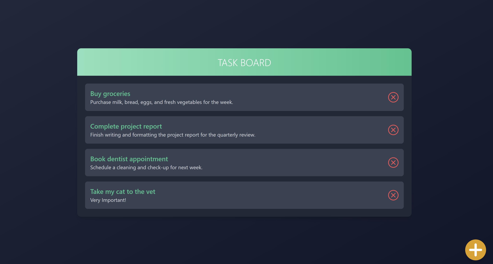

# Task Management API

## Description

This project is a simple Task Management API built using Node.js and Express. It provides basic CRUD (Create, Read,
Update, Delete) operations for managing tasks. The API supports endpoints to create new tasks, fetch all tasks, update
task details, and delete tasks.

## Features

- **Create Task**: Add a new task by providing a title and description via a `POST` endpoint.
- **Fetch Tasks**: Retrieve a list of all tasks via a `GET` endpoint.
- **Fetch Task By ID**: Retrieve a single task via a `GET` endpoint.
- **Update Task**: Modify the title or description of an existing task using a `PUT` endpoint with the task ID.
- **Delete Task**: Remove a task by specifying its ID through a `DELETE` endpoint.

## Validation and Data Storage

- Input validation ensures that all required fields (title and description) are provided.
- Tasks are stored in a JSON file.

## A Simple UI was implemented for Demonstration

## How to Run

1. Clone the repository.
2. To run the API `cd api` `npm i` `npm start`.
3. To run the Tests `cd api` `npm test`.
4. To run the Client `cd client` `npm i` `npm run dev`.

## Documentation

- Documentation with Swagger can be found on `http://localhost:3000/api-docs`

## The API can be tested with Postman

- The Collection for Postman can be found in the `api` folder. It can be imported to Postman and used for testing.
